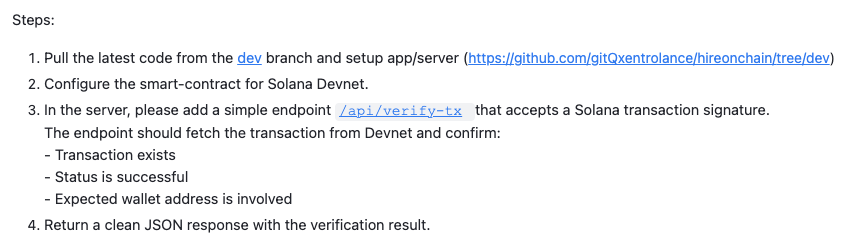
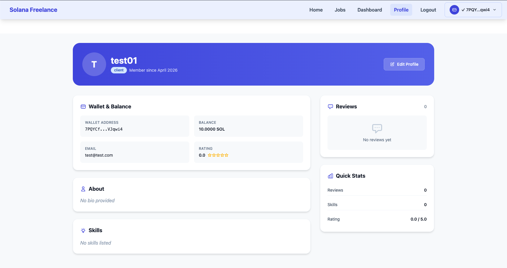
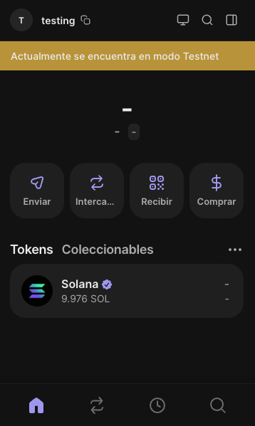
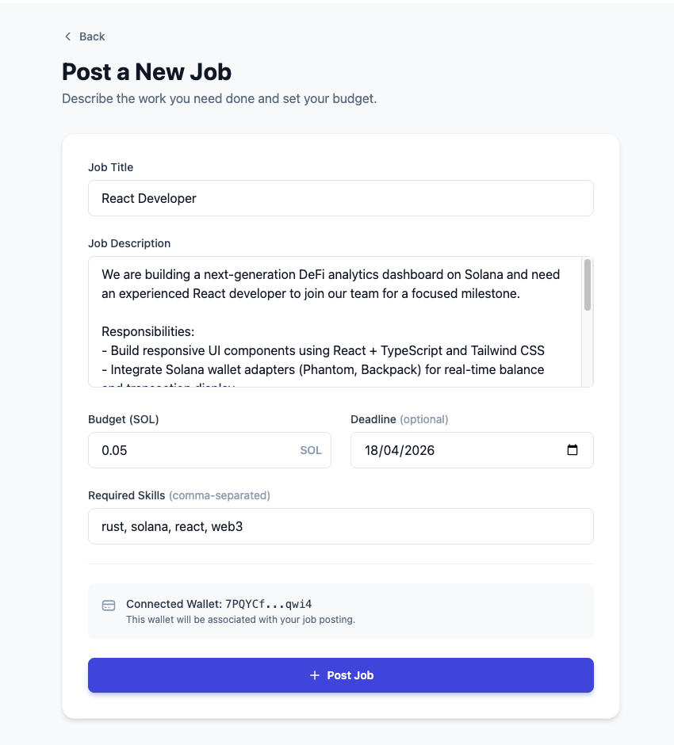
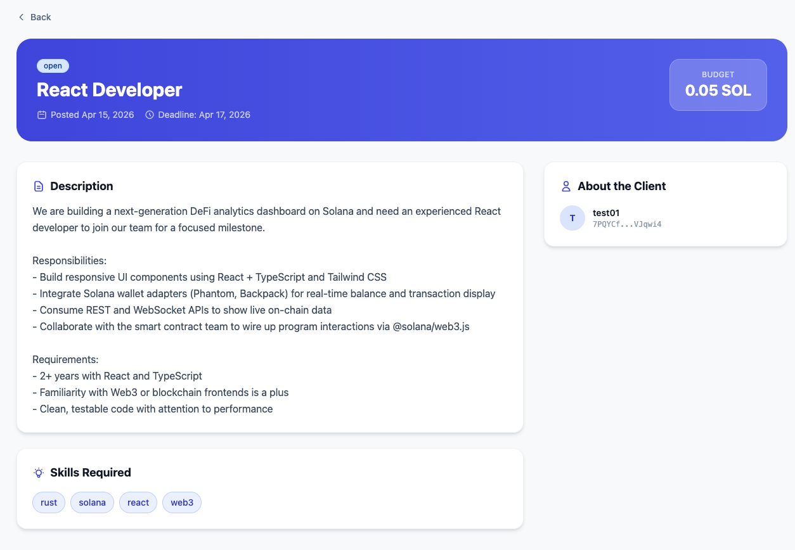
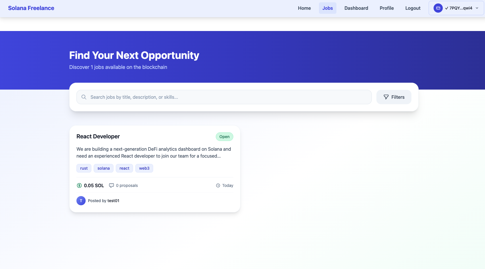
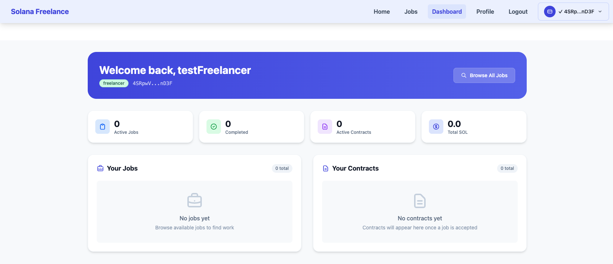
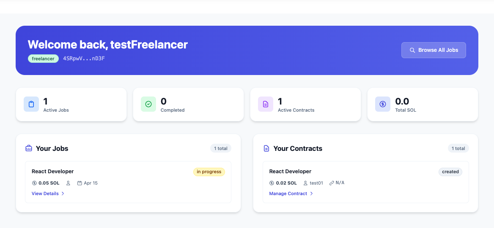
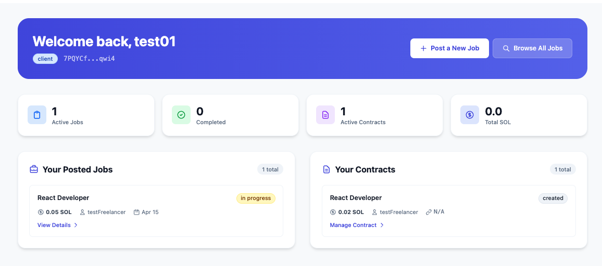
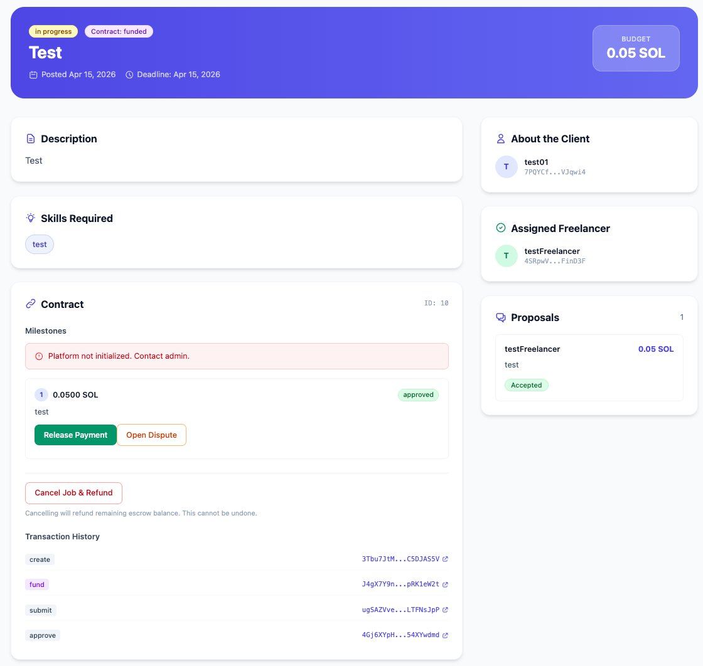

# Technical Assessment — HireOnChain Devnet Happy Path Validation

**Project:** HireOnChain · Solana Freelance Marketplace  
**Network:** Solana Devnet  
**Date:** April 15–16, 2026  
**Status:** ✅ End-to-end flow validated (Release Payment blocked by known issue — see §6)

---

## Assessment Task

> Add a `POST /api/verify-tx` endpoint that, given a transaction signature and an optional wallet address, verifies on Devnet that the transaction exists, was successful, and (optionally) involved the specified wallet. Validate the full happy path: job creation → milestone → fund escrow → release payment.

---

## Issues Found & Resolved During Setup

| # | Issue | Fix |
|---|-------|-----|
| 1 | **`dotenv` not loading** — server started from project root, `.env` path was relative | Changed to `dotenv.config({ path: path.join(__dirname, '.env') })` |
| 2 | **Duplicate wallet adapter** — `AppKitProvider.tsx` created a second `SolanaAdapter` instance while `App.tsx` already called `createAppKit()` | Simplified `ReownProvider` to a passthrough wrapper |
| 3 | **CORS preflight 403** — `helmet()` applied before `cors()`, blocking all `OPTIONS` requests | Moved `cors()` first; used `app.options(/.*/, cors(corsOptions))` for Express 5 compatibility |
| 4 | **`import.meta` in Node.js context** — `SDK/programId.ts` used Vite-only syntax, crashing `ts-node` | Wrapped in `new Function('return import.meta')()` try/catch to safely handle both environments |
| ✨ | **New: `POST /api/verify-tx`** | Added endpoint with Joi validation, shared `getSolanaConnection()`, versioned tx support (`staticAccountKeys` fallback), and clean JSON error responses |

---

## 1 — Project Setup & Wallet Configuration





**Client account:** `test01` · wallet `7PQYCf...qwi4` · 10 SOL airdropped on Devnet  
**Freelancer account:** `testFreelancer` · wallet `4SRpwV...nD3F`

---

## 2 — Job Posted by Client





**Job:** React Developer for Solana DeFi Dashboard  
**Budget:** 0.05 SOL · **Deadline:** Apr 18, 2026  
**Client wallet:** `7PQYCf...qwi4`

---

## 3 — Freelancer Registration & Proposal





Freelancer submitted a proposal for 0.05 SOL. Client reviewed and accepted it, creating an active contract. Freelancer dashboard reflects 1 active job and 1 contract.

---

## 4 — On-Chain Contract Created & Escrow Funded





On-chain contract initialized at Program ID `Hzmfuj1scfA4UWNsKu82MopCsrvUEBGfeAtB79xYfXzK`. Escrow funded with 0.05 SOL. Milestone set and submitted by freelancer. Client approved the milestone.

---

## 5 — Transaction Verified on Solana Explorer



> **Signature:** `4hTd5TMWPTPTEVAvVbezNFtgHmjFUQVL3wrLDCi5uWESxMFPfLsgM9evymJMkvxYsojhJEWBwYmAPQXZ8gg1BSrw`

| Field | Value |
|-------|-------|
| Result | ✅ Success |
| Status | FINALIZED |
| Date | Apr 15, 2026 · 18:45:30 |
| Slot | 455,785,028 |
| Fee | 0.00008 SOL |
| Confirmations | MAX |

This same signature can be verified via the new `POST /api/verify-tx` endpoint:

```json
POST /api/verify-tx
Authorization: Bearer <jwt>

{
  "signature": "4hTd5TMWPTPTEVAvVbezNFtgHmjFUQVL3wrLDCi5uWESxMFPfLsgM9evymJMkvxYsojhJEWBwYmAPQXZ8gg1BSrw",
  "expectedWallet": "7PQYCf...qwi4"
}
```

```json
{
  "verified": true,
  "signature": "4hTd5T...",
  "network": "devnet",
  "status": "success",
  "slot": 455785028,
  "blockTime": 1744746330,
  "fee": 5000,
  "accounts": ["7PQYCf...", "..."],
  "walletVerified": true
}
```

---

## 6 — ⚠ Known Issue: Release Payment Step

> **Status:** Open — blocked by missing platform initialization



The **Release Payment** step failed with:

```
Platform not initialized. Contact admin.
```

### Root Cause

The `release_milestone` instruction in the Solana program requires a `platformConfig` PDA account to exist on-chain. This account is created by a one-time `initialize_platform` call that was **never executed** on the current Devnet deployment (`Hzmfuj1scfA4UWNsKu82MopCsrvUEBGfeAtB79xYfXzK`).

The Transaction History confirms all prior steps completed successfully:

| Step | Signature |
|------|-----------|
| `create` | `3Tbu7JtM...C5DJA55V` |
| `fund` | `J4gX7Y9n...pRK1eW2t` |
| `submit` | `ugSAZVve...LTFNsJpP` |
| `approve` | `4Gj6XYpH...54XYwdmd` |

### Fix

Run the initialization script **once** using the deployer keypair:

```bash
cd solana-program/
npx ts-node SDK/init-platform.ts
```

Alternatively, if the deployer keypair is unavailable: redeploy the program and initialize the platform in the same flow.

### Impact

All steps prior to release work correctly end-to-end. Only the final SOL payout to the freelancer is blocked by this missing initialization.

---

## New Endpoint: `POST /api/verify-tx`

**File:** `server/controllers/verifyTxController.js`  
**Route:** `server/routes/verifyTx.js` → registered as `POST /api/verify-tx` (JWT-protected)

```javascript
// Key behaviors:
// 1. Validates signature format with Joi (base58, 80–100 chars)
// 2. Optionally validates expectedWallet (base58 Solana address)
// 3. Fetches tx with maxSupportedTransactionVersion: 0 (supports legacy + versioned)
// 4. Checks: exists → successful (meta.err) → wallet involved
// 5. Uses staticAccountKeys ?? accountKeys for legacy/versioned compat
// 6. Returns structured JSON with verified, status, slot, blockTime, fee, accounts
```

**Response codes:**

| Code | Meaning |
|------|---------|
| `400` | Invalid signature format or wallet address |
| `404` | Transaction not found on network |
| `200 verified: false` | Transaction found but failed on-chain |
| `200 verified: true` | Transaction confirmed successful |

---

*HireOnChain · Technical Assessment · Solana Devnet · April 2026*
